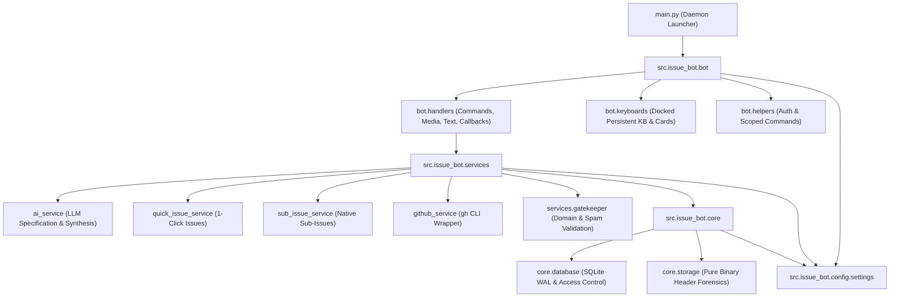

<div align="center">

# 🤖 Telegram AI Issue Bot Template
### Production-Grade Clean Architecture Boilerplate for Telegram QA & GitHub Issue Bots

[](https://github.com/Brosfeer/telegram-ai-issue-bot-template/actions)
[](https://www.python.org/)
[-purple.svg)](#-architecture--subsystem-layout)
[](https://opensource.org/licenses/MIT)
[](https://python-telegram-bot.org/)
[](https://cli.github.com/)

**English** | [العربية](#-نظرة-عامة-باللغة-العربية)

</div>

---

## 🌟 Overview

The **Telegram AI Issue Bot Template** is a production-ready, batteries-included starter kit designed for software engineering and QA squads. It enables seamless bug reporting, screenshot ingestion, and automated GitHub Issue / Sub-Issue creation directly from Telegram.

Built strictly around **Clean Architecture**, this template eliminates flat-file monoliths by cleanly partitioning your bot into **Config**, **Core**, **Services**, and **Bot Handlers** layers.

---

## 🏗️ Architecture & Subsystem Layout



---

## ✨ Key Features

- **📸 Media Album Debouncing**: Automatically groups multi-photo Telegram albums using `media_group_id` into a single consolidated staging card.
- **🐙 Direct GitHub CLI Asset Hosting**: Leverages `gh issue create --attach` to host QA screenshots directly on GitHub's secure asset CDN without relying on brittle third-party image hosts.
- **🌳 Native GitHub Sub-Issues Hierarchy**: Automatically splits multi-observation batches into native GitHub Sub-Issues (`--parent <N>`) with architectural diagnosis tables.
- **🛡️ Domain Gatekeeper & Chatter Blocker**: Rejects greetings, emoji-only spam, and conversational chatter before they pollute your issue tracker.
- **⌨️ Docked Persistent Keyboards**: Explicitly configured with `is_persistent=True` so custom keyboard buttons never auto-hide while typing on mobile or desktop.
- **📋 Scoped Native Command Menus**: Registers tailored `setMyCommands` menus for QA testers vs. Admins via `post_init`.
- **🔒 Multi-Tier Access Control & Concurrency Locks**: SQLite WAL access authorization with admin interactive approvals and multi-click race condition prevention.
- **⚡ Lightweight Storage Forensics**: Pure Python image header parser (`inspect_image_file`) verifying PNG, JPEG, and WEBP dimensions without heavy PIL/Pillow dependencies.

---

## 📁 Repository Directory Layout

```text
telegram-ai-issue-bot-template/
├── .github/
│   └── workflows/
│       └── ci.yml                  # Multi-version Python CI pipeline
├── src/
│   └── issue_bot/
│       ├── config/                 # Settings, environment & path resolution
│       │   ├── __init__.py
│       │   └── settings.py
│       ├── core/                   # Low-level primitives (WAL SQLite, storage)
│       │   ├── __init__.py
│       │   ├── database.py
│       │   └── storage.py
│       ├── services/               # Business logic & integrations
│       │   ├── __init__.py
│       │   ├── ai_service.py
│       │   ├── gatekeeper.py
│       │   ├── github_service.py
│       │   ├── quick_issue_service.py
│       │   └── sub_issue_service.py
│       └── bot/                    # Telegram presentation layer
│           ├── __init__.py
│           ├── app.py
│           ├── helpers.py
│           ├── keyboards.py
│           └── handlers/           # Modular Telegram event handlers
│               ├── __init__.py
│               ├── callbacks.py
│               ├── commands.py
│               ├── media.py
│               └── text.py
├── tests/                          # 100% Passing test suites
│   ├── bot/
│   ├── core/
│   ├── services/
│   └── conftest.py
├── .env.example                    # Sample environment template
├── .gitignore
├── AGENTS.md                       # Comprehensive guide for AI coding assistants
├── LICENSE                         # MIT License
├── main.py                         # Clean 35-line entrypoint daemon
├── pyproject.toml
├── pytest.ini
├── README.md
└── requirements.txt
```

---

## 🚀 Quick Start Guide

### 1. Prerequisites
- **Python 3.10+** installed.
- **GitHub CLI (`gh`)** installed and authenticated:
  ```bash
  gh auth login
  ```
- A **Telegram Bot Token** from [@BotFather](https://t.me/BotFather).

### 2. Installation
```bash
# Clone the repository
git clone https://github.com/Brosfeer/telegram-ai-issue-bot-template.git
cd telegram-ai-issue-bot-template

# Create and activate virtual environment
python3 -m venv .venv
source .venv/bin/activate

# Install dependencies
pip install -r requirements.txt
```

### 3. Configuration
Copy the sample environment file and configure your credentials:
```bash
cp .env.example .env
```
Edit `.env`:
```ini
TELEGRAM_BOT_TOKEN=your_telegram_bot_token_here
ADMIN_USER_ID=0
TARGET_REPO_NAME=owner/repository
TARGET_REPO_DIR=/path/to/target/repository
TARGET_BASE_BRANCH=main
```

### 4. Run the Bot
```bash
python main.py
```

### 5. Production Deployment (PM2)
```bash
pm2 start main.py --name "issue-bot" --interpreter .venv/bin/python
pm2 save
pm2 startup
```

---

## 🧪 Testing & Verification

Run the automated test suite with `pytest`:
```bash
pytest -v
```

---

## 🇸🇦 نظرة عامة باللغة العربية

قالب **Telegram AI Issue Bot Template** هو قالب مفتوح المصدر بمعمارية برمجية نظيفة (Clean Architecture) لإنشاء بوتات تيليجرام متخصصة في إدارة الجودة (QA) وإنشاء تذاكر GitHub Issues تلقائياً.

### أبرز المميزات:
1. **تجميع ألبومات الصور الذكي (Album Debouncing)**: دمج لقطات الشاشة المتعددة في دفعة واحدة وتفادي إغراق المستخدم بالرسائل.
2. **الربط المباشر مع GitHub CLI**: رفع الصور لشبكة أصول GitHub الرسمية عبر `--attach` دون الحاجة لخوادم وسيطة.
3. **التذاكر الفرعية الأصلية (Native Sub-Issues)**: إنشاء مهام فرعية مستقلة مرتبطة بالتذكرة الرئيسية عبر `--parent`.
4. **بوابة تصفية الرسائل (Gatekeeper)**: استبعاد المحادثات الجانبية والرسائل العشوائية والتركيز على البلاغات التقنية فقط.
5. **كيبورد دائم مثبت (`is_persistent=True`)**: أزرار ثابتة لا تختفي أثناء الكتابة في الهواتف الذكية.
6. **قوائم أوامر مخصصة (`setMyCommands`)**: توزيع صلاحيات الأوامر بين المختبرين والمشرفين.

---

## 👨‍💻 Author & Engineering Leadership

Engineered with architectural discipline by **Sharaf** ([@Brosfeer](https://github.com/Brosfeer)) — Principal Mobile & Systems Architect & Founder of **SayaSky Studio**.

- **GitHub**: [@Brosfeer](https://github.com/Brosfeer)
- **Studio**: **SayaSky Studio** ([Google Play](https://play.google.com/store/apps/details?id=com.sayasky.kiddyzonetown&hl=ar))
- **Specialization**: Mobile Systems, Real-Time Telemetry & Clean Architecture

---

## 📄 License

Distributed under the **MIT License**. See [LICENSE](LICENSE) for details.
